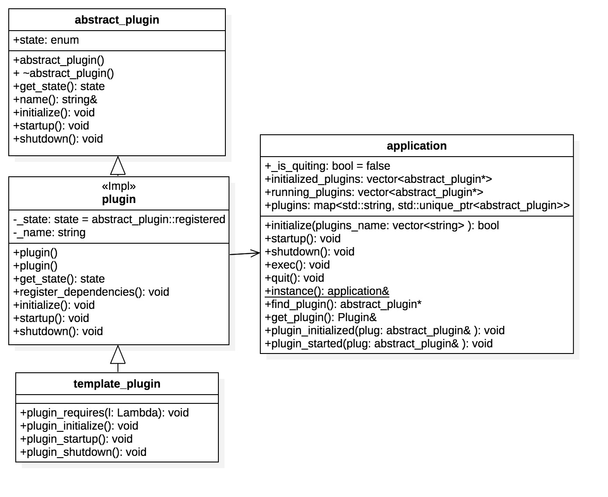

# 插件框架


### 插件框架的改进
EOS 的插件框架相对于 BTS 插件框架有了很大的改进，完全做到了添加一个新的插件只需要改 CMakeLists.txt 而不需要在代码上有任何耦合。( BTS 的即使你写完，也得去 main.cpp 添加 register_plugin，这并不友好 )。

BTS 添加插件流程
1. 添加一个插件
2. 在 libraries/plugin/CMakeLists.txt 添加依赖配置。
3. 在 programs/witness_node/CMakeLists.txt 添加依赖配置。(ps: 这里取决于你要添加到那个 nodeos 端)
4. 在 programs/witness_node/main.cpp 添加 register_plugin 代码。

EOS 添加插件流程
1. 添加一个插件
2. 在 plugins/CMakeLists.txt 添加依赖配置
3. 在 programs/nodeos/CMakeLists.txt 添加以来配置

对比起来就相差第 4 步，但是这让你对插件的添加删除做到只修改配置而不需要修改代码。

接下来我们简单的实现这个插件框架

### 插件特性

在写代码之前先确定好插件框架需要完成的事情

提供一个框架， 管理插件的生命周期，并确保按正确顺序配置，初始化，启动与关闭。

1. 关键特性
    1. 动态加载执行插件
    2. 按顺序加载相关插件
    3. 最小依赖关系
    
2. template_plugin 需要有的生命周期
    1. 初始化 - 在插件启动前做一些初始化步骤
    2. 启动
    3. 关闭
    
3. 插件按照依赖关系先后启动， 关闭则与启动顺序相反。 

### 需求分析与方案

OK， 根据这些需求画出类图

<p></p>

既然需要统一管理生命周期，那么就需要所有插件有相同的生命周期， 如此便定义 abstract_plugin 作为所有插件的基类，在该基类定义生命周期函数( initialize、startup、shutdown )。  
所有的插件应该只需被实例化一次， 所以都应该是单例模式。 但是多个插件多个单例，这样去实例化的话的会让代码很难解耦，采用单例模板类的方式，用 plugin<Impl> ( Impl 为插件类  )，统一通过 plugin 类来实例化插件对象。如此对于 application 来说，它只需要知道 plugin 这个类就行，其他类对它是透明的。  
template_plugin 既然由 plugin 控制生命周期，那么需要提供固定接口给 plugin 调用。即一套完整的生命周期接口。  
当插件类的结构弄清楚后，就需要来设计容器 application。  
application 主要功能注册并实例化对象( register_plugin )、控制 plugin 的生命周期( initialize、startup、shutdown )、对外提供 plugin 的单例对象( find_plugin、get_plugin )。  
当然，application 管理单例对象，那么它也应该是一个单例对象。

### 源码介绍

接下来简单介绍下实现的代码。

#### 插件的注册与实例化
```
application.hpp application 
std::map<std::string, std::unique_ptr<abstract_plugin>> plugins; // 类名与插件对象指针的映射

// 注册插件，实例化，以便通过名字便能找到该实例。
template<typename Plugin>
auto& register_plugin(){
    // 判断插件是否实例化过， 若有直接返回对象引用
    auto existing = find_plugin<Plugin>();
    if ( existing ){
        return *existing;
    }

    auto plug = new Plugin();
    plugins[plug->name()].reset(plug);
    plug->register_dependencies();
    return *plug;

}

test_plugin.cpp test_plugin
// 定义静态全局变量， 保证在最开始便执行该初始化式
static abstract_plugin& _test_plugin = app().register_plugin<test_plugin>();
```
通过 register_plugin 去实例化插件，同时将该对象指针存储下来。对同个插件的多次注册只实例化一次。
通过声明静态全局变量去注册插件， 这样在程序初始化的时候就会把所有插件都实例化完。

#### 插件的初始化
```
main.cpp
int main() {
    // 这里插件的配置就直接通过 plugins 数组来配置， 就不使用配置文件了
    vector<string> plugins = {"plugin::test_plugin"};
    // 初始化插件
    app().initialize<default_plugin>(plugins);
    // 启动容器
    app().startup();
    // 关闭容器
    app().shutdown();
    return 0;
}

application.hpp application
template<typename... Plugin>
bool initialize(vector<string> plugins_name){
    std::vector<abstract_plugin*> default_start_plugin = {find_plugin<Plugin>()...};

    try{
        // 初始化默认插件
        for(auto plugin : default_start_plugin){
            plugin->initialize();
        }

        // 初始化动态配置的插件
        for(auto plugin_name : plugins_name){
            get_plugin(plugin_name).initialize();
        }
    } catch(...) {
        cout<<"init failed"<<endl;
        return false;
    }
    return true;
}

application.hpp plugin<Impl>
// 初始化插件
virtual void initialize() override {
    if (_state == registered ) {
        _state = initialized;
        // 先初始化依赖插件
        static_cast<Impl*>(this)->plugin_requires([&](auto& plug){ plug.initialize(); });
        static_cast<Impl*>(this)->plugin_initialize();
        // 存储初始化成功的插件
        app().plugin_initialized(*this);
    }

    assert(_state == initialized);// 初始化失败抛异常。
}
```
随着插件的注册完成，插件应跟随容器初始化，启动
通过 插件名称，可以直接获取到该插件的对象，进行一些列操作，在这里就进行了初始化的操作.
初始化插件时应先去初始化它依赖的插件，避免引用到空指针。

#### 插件的启动
```
application.cpp application
void application::startup() {

    // 因为没加入其它功能，所以只有启动插件这个操作
    // 启动插件
    for( auto plugin : initialized_plugins ) {
        if( is_quiting() ) return;
        plugin->startup();
    }

}


application.hpp plugin
// 启动插件
virtual void startup() override {
    if ( _state == initialized ) {
        _state = started;
        // 先启动依赖插件
        static_cast<Impl*>(this)->plugin_requires([&](auto& plug){ plug.startup(); });
        static_cast<Impl*>(this)->plugin_startup();
        // 存储启动成功的插件
        app().plugin_started(*this);
    }
    assert(_state == started);// 启动失败抛异常。
}
```
可以看到跟初始化插件差不多，需要先初始化依赖插件。


### 插件的关闭
```
application.cpp application
void application::shutdown() {

    // 最晚开启的插件应该最先关闭
    for(auto ritr = running_plugins.rbegin();
        ritr != running_plugins.rend(); ++ritr) {
        (*ritr)->shutdown();
        plugins.erase((*ritr)->name());
    }

    running_plugins.clear();
    initialized_plugins.clear();
    plugins.clear();
}

// 关闭插件，插件关闭时应跟初始化相反的顺序。
virtual void shutdown() override {
    if (_state == started) {
        _state = stopped;
        static_cast<Impl*>(this)->plugin_shutdown();
    }
}

```
关闭插件应该跟启动顺序相反， 所以这里使用了 rbegin 去获取尾部指针。

插件框架的实现并不复杂， 主要运用的设计模式为工厂模式与单例模式。

熟悉 BTS 插件框架的人可以看到，EOS 和 BTS 的插件化结构其实差不多。如果把 application 类建造成一个单例模式，也可以将第四步去掉。
但静态变量是程序定义经过其定义式的时候才会初始化，所以在 CMakeLists.txt 添加插件依赖的时候需要加入 whole_archive_flag( 在程序启动时就链接进其变量及函数，具体原理自行百度哈 )，例如本框架， 如果不加入该配置，动态加载的插件都会报 unable find plugin (跟静态变量的生命周期有关)。

OK， EOS 的插件框架就讲完了，具体代码可以查看: https://github.com/firesWu/demo/tree/master/plugin_demo
